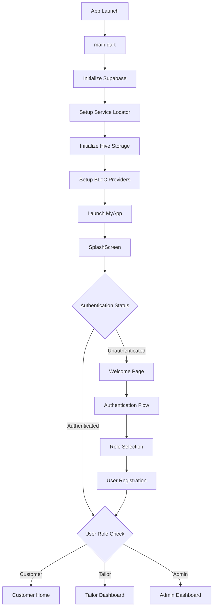
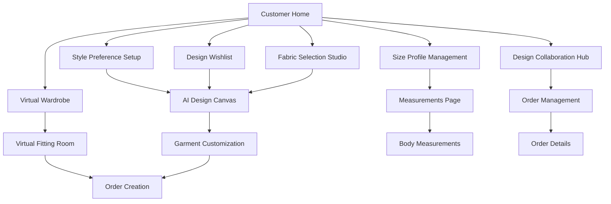
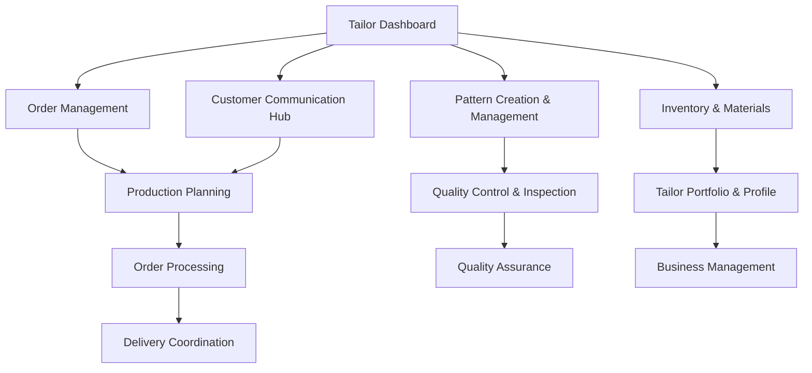
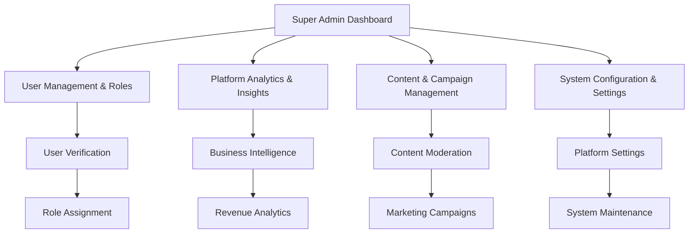
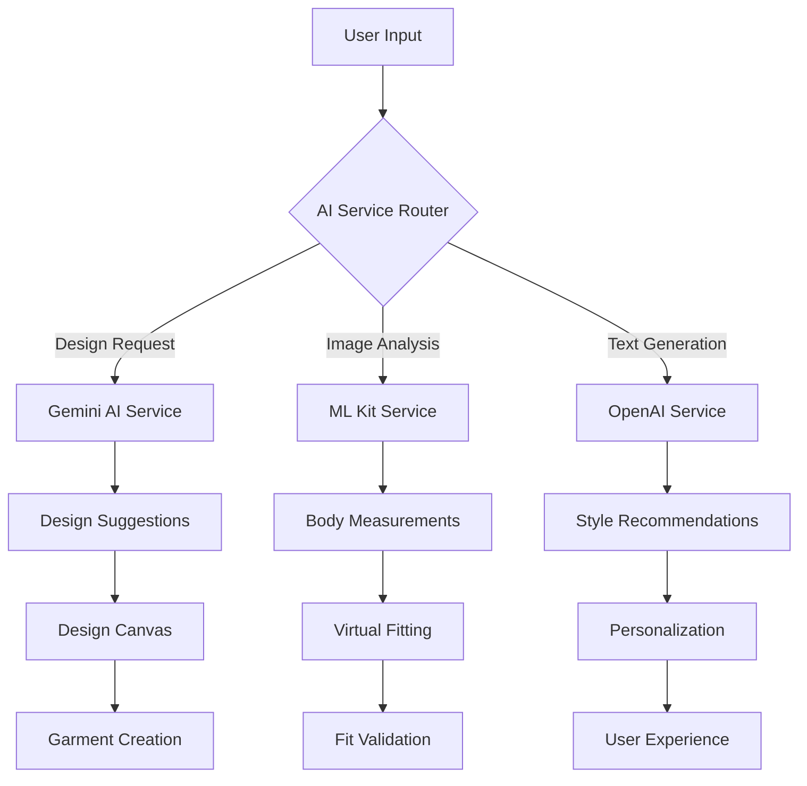
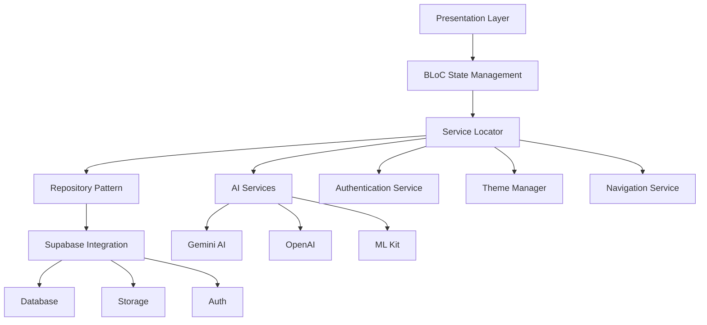
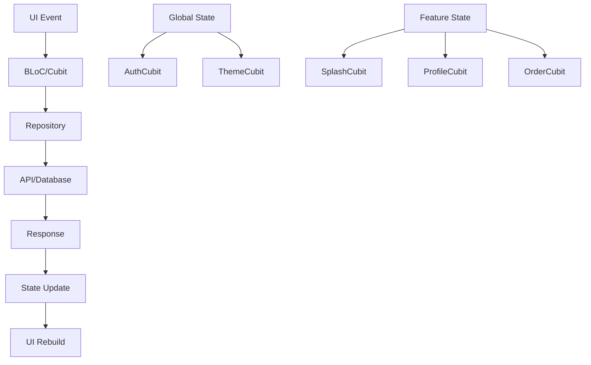

# AI Tailoring App - Complete Architecture & Flow Documentation

## 🏗️ **APPLICATION ARCHITECTURE**

### **📱 App Overview**

The AI Tailoring App is a sophisticated Flutter application built with role-based architecture supporting three distinct user types: **Customers**, **Tailors**, and **Admins**. The app leverages Supabase for backend services, AI services for intelligent features, and follows a clean architecture pattern with BLoC state management.

### **🎯 Core Technologies**

- **Frontend**: Flutter with BLoC pattern
- **Backend**: Supabase (Authentication, Database, Storage)
- **AI Integration**: Gemini AI, OpenAI, ML Kit
- **Navigation**: GoRouter with role-based routing
- **State Management**: BLoC/Cubit
- **Dependency Injection**: GetIt service locator
- **Theming**: Custom ThemeManager with light/dark modes
- **Localization**: Easy Localization

---

## 🔄 **APPLICATION FLOW ARCHITECTURE**

### **📍 Entry Point & Initialization Flow**



### **🔐 Authentication & Role Management**

```mermaid
graph TD
    A[Welcome Page] --> B{User Action}
    B -->|Sign In| C[Phone/Email + PIN]
    B -->|Sign Up| D[Registration Form]
    B -->|Guest| E[Anonymous Access]

    C --> F{Validate Credentials}
    F -->|Success| G[Get User Profile]
    F -->|Failed| H[Auth Error]

    D --> I[Create Account]
    I --> J[Select Role]
    J -->|Customer| K[Customer Profile Setup]
    J -->|Tailor| L[Tailor Profile Setup]
    J -->|Admin| M[Admin Verification]

    G --> N{Role-Based Routing}
    N -->|Customer| O[/customer/home]
    N -->|Tailor| P[/tailor/dashboard]
    N -->|Admin| Q[/admin/dashboard]
```

---

## 🎭 **ROLE-BASED SCREEN ARCHITECTURE**

### **👤 Customer Journey (12 Core Screens)**



**Customer Screen Hierarchy:**

1. **Customer Home** (`/customer/home`) - Main dashboard with personalized content
2. **Style Preference Setup** (`/customer/style-preference-setup`) - Initial style configuration
3. **Design Wishlist** (`/customer/design-wishlist`) - Saved designs and inspirations
4. **Virtual Wardrobe** (`/customer/virtual-wardrobe`) - Personal clothing collection
5. **Size Profile Management** (`/customer/size-profile-management`) - Body measurements management
6. **Design Collaboration Hub** (`/customer/design-collaboration`) - Work with designers/tailors
7. **Fabric Selection Studio** (`/customer/fabric-selection`) - Choose materials and textures
8. **Additional Customer Features**: Order timeline, feedback system, payment history, loyalty rewards

### **✂️ Tailor Journey (8 Core Screens)**



**Tailor Screen Hierarchy:**

1. **Tailor Dashboard** (`/tailor/dashboard`) - Business overview and metrics
2. **Order Management** (`/tailor/order-management`) - Handle customer orders
3. **Pattern Creation & Management** (`/tailor/pattern-creation-management`) - Design patterns
4. **Inventory & Materials** (`/tailor/inventory-materials`) - Manage stock and supplies
5. **Customer Communication Hub** (`/tailor/customer-communication-hub`) - Client interaction
6. **Production Planning** (`/tailor/production-planning`) - Schedule and workflow
7. **Quality Control & Inspection** (`/tailor/quality-control-inspection`) - QA processes
8. **Tailor Portfolio & Profile** (`/tailor/portfolio-profile`) - Showcase work and profile

### **🛡️ Admin Journey (5 Core Screens)**



**Admin Screen Hierarchy:**

1. **Super Admin Dashboard** (`/admin/dashboard`) - Platform overview and system health
2. **User Management & Roles** (`/admin/user-management-roles`) - Manage users and permissions
3. **Platform Analytics & Insights** (`/admin/platform-analytics-insights`) - Business metrics
4. **Content & Campaign Management** (`/admin/content-campaign-management`) - Marketing control
5. **System Configuration & Settings** (`/admin/system-configuration-settings`) - Platform settings

---

## 🧠 **AI FEATURES INTEGRATION**

### **🎨 AI-Powered Features Flow**



**AI Integration Points:**

- **Design Canvas** (`/design-canvas`) - AI-assisted design creation
- **Virtual Fitting** (`/virtual-fitting`) - AR-based fitting simulation
- **AI Suggestions** (`/ai-suggestions`) - Intelligent recommendations
- **Measurements** (`/measurements`) - AI-powered body measurement
- **Fabric Library** (`/fabric-library`) - Smart fabric recommendations
- **Pattern Library** (`/pattern-library`) - AI-generated patterns

---

## 🔒 **SECURITY & ROUTE PROTECTION**

### **🛡️ Route Guard System**

```mermaid
graph TD
    A[Route Request] --> B{Authentication Check}
    B -->|Authenticated| C{Role Authorization}
    B -->|Unauthenticated| D[Redirect to Login]

    C -->|Authorized| E[Allow Access]
    C -->|Unauthorized| F[Redirect to Role Home]

    D --> G[/auth/welcome]
    F --> H{User Role}
    H -->|Customer| I[/customer/home]
    H -->|Tailor| J[/tailor/dashboard]
    H -->|Admin| K[/admin/dashboard]
```

**Route Protection Levels:**

1. **Public Routes**: Welcome, Introduction, Language Selection
2. **Authenticated Routes**: All role-specific screens
3. **Role-Restricted Routes**: Each role has specific access permissions
4. **Admin-Only Routes**: Platform management and analytics

---

## 📱 **SCREEN CONNECTION PATTERNS**

### **🔗 Navigation Patterns**

```mermaid
graph TD
    A[Common Screens] --> B[Settings]
    A --> C[Profile]
    A --> D[Notifications]
    A --> E[Support]

    F[Customer Screens] --> G[Home → Design Canvas]
    F --> H[Home → Virtual Fitting]
    F --> I[Home → Orders]
    F --> J[Design → Customization]

    K[Tailor Screens] --> L[Dashboard → Orders]
    K --> M[Dashboard → Inventory]
    K --> N[Orders → Communication]
    K --> O[Patterns → Creation]

    P[Admin Screens] --> Q[Dashboard → Users]
    P --> R[Dashboard → Analytics]
    P --> S[Users → Roles]
    P --> T[Analytics → Reports]
```



### **🎯 Core User Flows**

**Customer Design Flow:**

1. `Customer Home` → `Design Canvas` → `Fabric Selection` → `Virtual Fitting` → `Order Creation`

**Tailor Order Flow:**

1. `Tailor Dashboard` → `Order Management` → `Pattern Creation` → `Production Planning` → `Quality Control`

**Admin Management Flow:**

1. `Admin Dashboard` → `User Management` → `Platform Analytics` → `System Configuration`

---

## 🔧 **TECHNICAL ARCHITECTURE**

### **📦 Service Layer Architecture**



### **🗂️ Project Structure**

```txt
lib/
├── core/                    # Core business logic
│   ├── cubit/              # Global state management
│   ├── models/             # Data models
│   ├── navigation/         # Routing logic
│   ├── repositories/       # Data access layer
│   ├── services/           # Business services
│   └── theme/              # UI theming
├── view/                   # UI screens
│   ├── admin/              # Admin screens
│   ├── auth/               # Authentication screens
│   ├── customer/           # Customer screens
│   ├── tailor/             # Tailor screens
│   └── common/             # Shared screens
└── product/                # App-specific configurations
    ├── enum/               # Enumerations
    └── lang/               # Localization
```

---

## 🎨 **UI/UX ARCHITECTURE**

### **🌈 Theme System**

- **Light/Dark Mode**: Automatic system preference detection
- **Custom Color Schemes**: Role-based color palettes
- **Responsive Design**: ScreenUtil for device adaptation
- **Material Design 3**: Modern UI components

### **🌍 Internationalization**

- **Multi-language Support**: Easy Localization integration
- **Dynamic Language Switching**: Runtime language changes
- **Locale-specific Formatting**: Currency, dates, numbers

---

## 🔄 **STATE MANAGEMENT FLOW**

### **📊 BLoC Architecture**



---

## 🚀 **DEPLOYMENT & SCALING**

### **📈 Performance Optimizations**

- **Lazy Loading**: Services and screens loaded on demand
- **Caching Strategy**: Hive for local storage
- **Image Optimization**: Cached network images
- **Memory Management**: Proper disposal of controllers

### **🔐 Security Measures**

- **Role-based Access Control**: Granular permissions
- **Route Guards**: Authentication and authorization
- **Data Encryption**: Secure local storage
- **API Security**: Supabase Row Level Security

---

## 🎯 **KEY FEATURES SUMMARY**

### **🔥 Core Functionalities**

1. **AI-Powered Design**: Intelligent garment creation
2. **Virtual Fitting**: AR-based try-on experience
3. **Body Measurements**: AI-assisted measurement capture
4. **Role-based Dashboards**: Customized user experiences
5. **Real-time Communication**: In-app messaging system
6. **Order Management**: End-to-end order tracking
7. **Quality Control**: Built-in QA processes
8. **Analytics Dashboard**: Business intelligence tools

### **🌟 Unique Selling Points**

- **AI Integration**: Multiple AI services for enhanced UX
- **Role Flexibility**: Supporting multiple user types
- **Scalable Architecture**: Clean separation of concerns
- **Real-time Features**: Live updates and notifications
- **Cross-platform**: Single codebase for iOS and Android

---

```txt
graph TD
    A["🚀 App Launch<br/>main.dart"] --> B["🔧 Initialize Supabase<br/>Backend Setup"]
    B --> C["⚙️ Setup Service Locator<br/>Dependency Injection"]
    C --> D["💾 Initialize Hive Storage<br/>Local Cache"]
    D --> E["🧩 Setup BLoC Providers<br/>State Management"]
    E --> F["📱 Launch MyApp<br/>Material App"]
    F --> G["✨ SplashScreen<br/>Loading & Auth Check"]

    G --> H{🔐 Authentication Status}
    H -->|✅ Authenticated| I{👤 User Role Check}
    H -->|❌ Unauthenticated| J["🎉 Welcome Page<br/>Entry Point"]

    I -->|👤 Customer| K["🏠 Customer Home<br/>/customer/home"]
    I -->|✂️ Tailor| L["📊 Tailor Dashboard<br/>/tailor/dashboard"]
    I -->|🛡️ Admin| M["🔧 Admin Dashboard<br/>/admin/dashboard"]

    J --> N["🔑 Authentication Flow<br/>Login/Register"]
    N --> O["🎭 Role Selection<br/>Choose User Type"]
    O --> P["📝 User Registration<br/>Profile Setup"]
    P --> I

    style A fill:#e1f5fe
    style G fill:#fff3e0
    style H fill:#f3e5f5
    style K fill:#e8f5e8
    style L fill:#fff8e1
    style M fill:#fce4ec

```

```txt
graph TD
    subgraph "👤 Customer Journey (12 Screens)"
        A1["🏠 Customer Home<br/>Dashboard & Overview"]
        A2["🎨 Style Preference Setup<br/>Initial Configuration"]
        A3["💝 Design Wishlist<br/>Saved Inspirations"]
        A4["👗 Virtual Wardrobe<br/>Personal Collection"]
        A5["📏 Size Profile Management<br/>Body Measurements"]
        A6["🤝 Design Collaboration Hub<br/>Work with Tailors"]
        A7["🧵 Fabric Selection Studio<br/>Material Choices"]
        A8["📅 Order Timeline<br/>Track Progress"]
        A9["⭐ Feedback & Reviews<br/>Rate Experience"]
        A10["💳 Payment & Billing<br/>Financial History"]
        A11["🎯 Style Consultation<br/>Expert Advice"]
        A12["🏆 Loyalty Rewards<br/>Points & Benefits"]
    end

    subgraph "✂️ Tailor Journey (8 Screens)"
        B1["📊 Tailor Dashboard<br/>Business Overview"]
        B2["📋 Order Management<br/>Handle Requests"]
        B3["✏️ Pattern Creation<br/>Design Templates"]
        B4["📦 Inventory & Materials<br/>Stock Management"]
        B5["📅 Production Planning<br/>Schedule Workflow"]
        B6["💬 Customer Communication<br/>Client Interaction"]
        B7["🔍 Quality Control<br/>QA Processes"]
        B8["🎨 Tailor Portfolio<br/>Showcase Work"]
    end

    subgraph "🛡️ Admin Journey (5 Screens)"
        C1["🎛️ Super Admin Dashboard<br/>Platform Overview"]
        C2["👥 User Management<br/>Roles & Permissions"]
        C3["📈 Platform Analytics<br/>Business Intelligence"]
        C4["📝 Content Management<br/>Marketing Control"]
        C5["⚙️ System Configuration<br/>Platform Settings"]
    end

    subgraph "🧠 AI Features (6 Core)"
        D1["🎨 Design Canvas<br/>AI-Assisted Creation"]
        D2["🥽 Virtual Fitting<br/>AR Try-On"]
        D3["💡 AI Suggestions<br/>Smart Recommendations"]
        D4["📏 Measurements<br/>AI Body Scanning"]
        D5["🧵 Fabric Library<br/>Smart Materials"]
        D6["📐 Pattern Library<br/>AI Patterns"]
    end

    A1 --> D1
    A1 --> D2
    A5 --> D4
    A7 --> D5
    B3 --> D6

    style A1 fill:#e8f5e8
    style B1 fill:#fff8e1
    style C1 fill:#fce4ec
    style D1 fill:#e3f2fd

```

```txt
graph TD
    subgraph "🔒 Security Layer"
        A["🌐 Route Request"] --> B{🔐 Authentication Check}
        B -->|✅ Authenticated| C{🛡️ Role Authorization}
        B -->|❌ Unauthenticated| D["↩️ Redirect to Login<br/>/auth/welcome"]

        C -->|✅ Authorized| E["✅ Allow Access<br/>Proceed to Screen"]
        C -->|❌ Unauthorized| F["↩️ Redirect to Role Home"]

        F --> G{👤 User Role}
        G -->|Customer| H["/customer/home"]
        G -->|Tailor| I["/tailor/dashboard"]
        G -->|Admin| J["/admin/dashboard"]
    end

    subgraph "🗂️ Route Categories"
        K["🌍 Public Routes<br/>• Welcome<br/>• Introduction<br/>• Language Selection"]
        L["🔐 Authenticated Routes<br/>• Profile<br/>• Settings<br/>• Notifications"]
        M["👤 Customer Routes<br/>• Design Canvas<br/>• Virtual Fitting<br/>• Orders"]
        N["✂️ Tailor Routes<br/>• Order Management<br/>• Pattern Creation<br/>• Inventory"]
        O["🛡️ Admin Routes<br/>• User Management<br/>• Analytics<br/>• System Config"]
    end

    subgraph "🧠 AI Service Architecture"
        P["User Input"] --> Q{🤖 AI Service Router}
        Q -->|Design Request| R["🎨 Gemini AI Service<br/>Creative Generation"]
        Q -->|Image Analysis| S["👁️ ML Kit Service<br/>Computer Vision"]
        Q -->|Text Generation| T["💬 OpenAI Service<br/>Natural Language"]

        R --> U["💡 Design Suggestions"]
        S --> V["📏 Body Measurements"]
        T --> W["✨ Style Recommendations"]
    end

    style A fill:#e1f5fe
    style B fill:#f3e5f5
    style C fill:#f3e5f5
    style E fill:#e8f5e8
    style K fill:#fff3e0
    style L fill:#f3e5f5
    style M fill:#e8f5e8
    style N fill:#fff8e1
    style O fill:#fce4ec
    style Q fill:#e3f2fd
```

This architecture ensures a robust, scalable, and maintainable application that can handle the complex workflows of the AI tailoring business while providing excellent user experiences for all stakeholder types.
