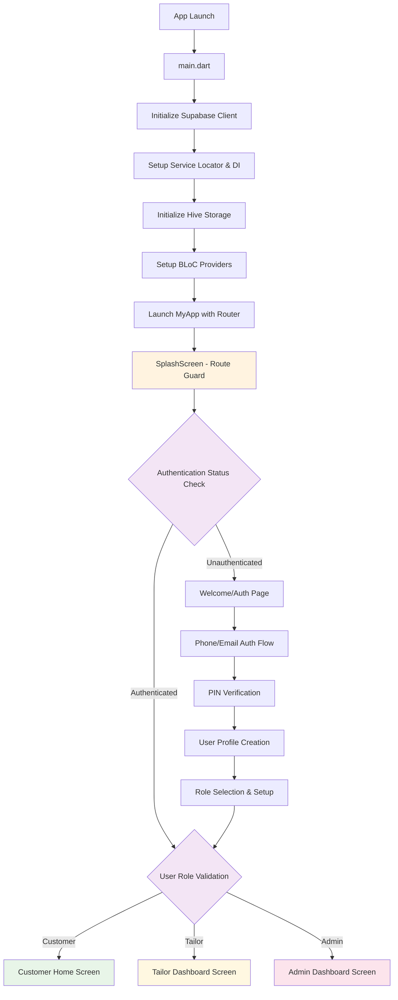
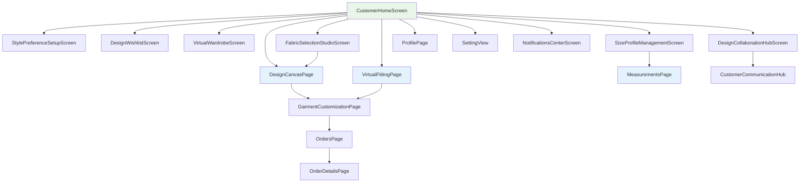
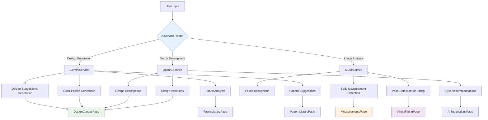
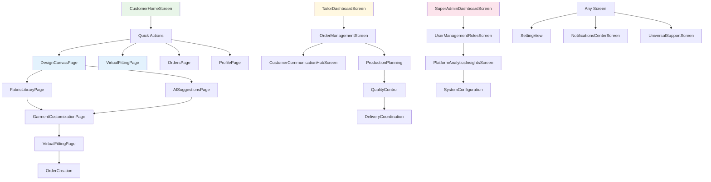
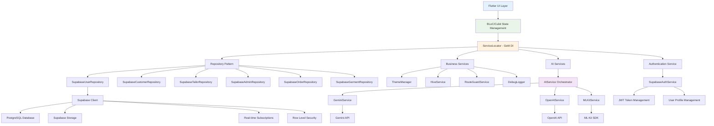
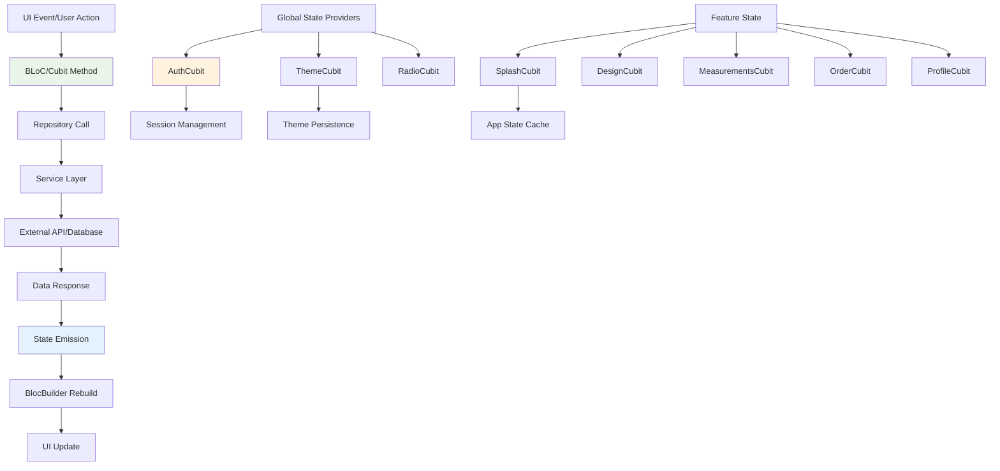

# AI Tailoring App - Complete Architecture & Flow Documentation

## 🏗️ **APPLICATION ARCHITECTURE**

### **📱 App Overview**

The AI Tailoring App is a sophisticated Flutter application built with role-based architecture supporting three distinct user types: **Customers**, **Tailors**, and **Admins**. The app leverages Supabase for backend services, AI services for intelligent features, and follows a clean architecture pattern with BLoC state management.

### **🎯 Core Technologies**

- **Frontend**: Flutter with BLoC/Cubit pattern
- **Backend**: Supabase (Authentication, Database, Storage, Real-time)
- **AI Integration**: Gemini AI, OpenAI, ML Kit for computer vision
- **Navigation**: GoRouter with role-based routing & route guards
- **State Management**: BLoC/Cubit with stream subscriptions
- **Dependency Injection**: GetIt service locator with lazy singletons
- **Local Storage**: Hive for caching and offline data
- **Theming**: Custom ThemeManager with light/dark modes
- **Localization**: Easy Localization with 23 languages
- **Security**: Row Level Security (RLS) with Supabase
- **Responsive Design**: ScreenUtil for device adaptation

### **🏛️ Clean Architecture Implementation**

```txt
Presentation Layer (UI/Screens)
    ↓
BLoC/Cubit (State Management)
    ↓
Repositories (Data Abstraction)
    ↓
Services (Business Logic)
    ↓
External APIs (Supabase, AI Services)
```

---

## 🔄 **APPLICATION FLOW ARCHITECTURE**

### **📍 Entry Point & Initialization Flow**



### **🔑 Authentication & User Management**

The app implements a sophisticated authentication system:

**Authentication Flow:**

1. **Supabase Auth Service** - Handles phone/email authentication
2. **PIN Verification** - 6-digit secure PIN system
3. **User Profile Creation** - Role-based profile setup
4. **Route Guard Service** - Validates access permissions
5. **Session Management** - Persistent authentication state

**User Roles & Permissions:**

- **Customer**: Design creation, orders, virtual fitting, measurements
- **Tailor**: Order management, patterns, inventory, customer communication
- **Admin**: User management, analytics, system configuration, content management

## 🎭 **COMPLETE SCREEN ARCHITECTURE & CONNECTIONS**

### **📱 All Available Routes (58 Total):**

**Public Routes (6):**

- `/splash` - SplashScreen (Entry point)
- `/auth/welcome` - WelcomePage
- `/intro` - Introduction (6-step onboarding)
- `/language-selection` - LanguageSelectionScreen
- `/support` - UniversalSupportScreen
- `/notifications` - NotificationsCenterScreen

**Customer Routes (12 + 6 Legacy):**

- `/customer/home` - CustomerHomeScreen ⭐️ _Main dashboard_
- `/customer/style-preference-setup` - StylePreferenceSetupScreen
- `/customer/design-wishlist` - DesignWishlistScreen
- `/customer/virtual-wardrobe` - VirtualWardrobeScreen
- `/customer/size-profile-management` - SizeProfileManagementScreen
- `/customer/design-collaboration` - DesignCollaborationHubScreen
- `/customer/fabric-selection` - FabricSelectionStudioScreen
- `/customer/order-timeline` - Order tracking
- `/customer/feedback-reviews` - Review system
- `/customer/payment-history-billing` - Financial management
- `/customer/style-consultation-booking` - Expert consultation
- `/customer/loyalty-rewards` - Gamification system

**Tailor Routes (8):**

- `/tailor/dashboard` - TailorDashboardScreen ⭐️ _Business hub_
- `/tailor/order-management` - OrderManagementScreen
- `/tailor/pattern-creation-management` - PatternCreationManagementScreen
- `/tailor/inventory-materials` - InventoryMaterialsScreen
- `/tailor/customer-communication-hub` - CustomerCommunicationHubScreen
- `/tailor/production-planning` - Production workflow
- `/tailor/quality-control-inspection` - QA processes
- `/tailor/portfolio-profile` - Portfolio showcase

**Admin Routes (5):**

- `/admin/dashboard` - SuperAdminDashboardScreen ⭐️ _Platform control_
- `/admin/user-management-roles` - UserManagementRolesScreen
- `/admin/platform-analytics-insights` - PlatformAnalyticsInsightsScreen
- `/admin/content-campaign-management` - Content management
- `/admin/system-configuration-settings` - System settings

**AI Features Routes (6):**

- `/design-canvas` - DesignCanvasPage ⭐️ _AI-powered design_
- `/virtual-fitting` - VirtualFittingPage ⭐️ _AR fitting room_
- `/ai-suggestions` - AISuggestionsPage
- `/measurements` - MeasurementsPage ⭐️ _AI body scanning_
- `/fabric-library` - FabricLibraryPage
- `/pattern-library` - PatternLibraryPage

**Legacy/Common Routes (7):**

- `/home` - HomePage (generic)
- `/orders` - OrdersPage
- `/order-details` - OrderDetailsPage
- `/profile` - ProfilePage
- `/garment-customization` - GarmentCustomizationPage
- `/setting` - SettingView
- `/measurements` - MeasurementsPage

---

## 🎭 **ROLE-BASED SCREEN ARCHITECTURE**

### **👤 Customer Journey & Screen Connections**



**Customer Screen Details:**

**Core Customer Screens:**

1. **CustomerHomeScreen** (`/customer/home`)

   - Personalized dashboard with recent orders
   - AI-curated style inspiration gallery
   - Quick actions: Design, AR Fitting, Orders, Profile
   - Weather-based recommendations
   - Loyalty points and gamification

2. **StylePreferenceSetupScreen** (`/customer/style-preference-setup`)

   - Initial style configuration and preferences
   - Body type and fit preferences
   - Color and pattern preferences

3. **DesignWishlistScreen** (`/customer/design-wishlist`)

   - Saved designs and inspirations
   - Social features and sharing
   - Inspiration board management

4. **VirtualWardrobeScreen** (`/customer/virtual-wardrobe`)

   - Personal clothing collection
   - Digital wardrobe management
   - Outfit coordination tools

5. **SizeProfileManagementScreen** (`/customer/size-profile-management`)

   - Body measurements management
   - Multiple profiles support
   - Integration with AI measurements

6. **DesignCollaborationHubScreen** (`/customer/design-collaboration`)

   - Real-time design collaboration
   - Communication with tailors
   - Design versioning and commenting
   - Live collaboration sessions

7. **FabricSelectionStudioScreen** (`/customer/fabric-selection`)
   - Advanced fabric browser
   - Material properties and care instructions
   - AI-powered fabric recommendations

### **✂️ Tailor Journey & Business Workflow**

```mermaid
graph TD
    A[TailorDashboardScreen] --> B[OrderManagementScreen]
    A --> C[PatternCreationManagementScreen]
    A --> D[InventoryMaterialsScreen]
    A --> E[CustomerCommunicationHubScreen]

    %% Order workflow
    B --> F[Production Planning]
    B --> G[Quality Control & Inspection]
    B --> H[Order Timeline Management]

    %% Pattern & Design workflow
    C --> I[PatternLibraryPage]
    C --> J[DesignCanvas Integration]

    %% Communication workflow
    E --> K[Live Chat with Customers]
    E --> L[Design Collaboration]

    %% Business management
    D --> M[Material Ordering]
    D --> N[Stock Management]
    A --> O[Portfolio Profile]
    A --> P[Business Analytics]

    %% Common navigation
    A --> Q[SettingView]
    A --> R[NotificationsCenterScreen]
    A --> S[UniversalSupportScreen]

    style A fill:#fff8e1
    style B fill:#ffe0b2
    style E fill:#f3e5f5
```



**Tailor Screen Details:**

**Core Business Screens:**

1. **TailorDashboardScreen** (`/tailor/dashboard`)

   - Business metrics and KPIs
   - Active orders overview
   - Recent notifications and updates
   - Quick actions for order management
   - Revenue and performance analytics

2. **OrderManagementScreen** (`/tailor/order-management`)

   - Complete order lifecycle management
   - Workflow steps: Received → Measurements → Cutting → Stitching → Fitting → QA → Delivery
   - Order filtering and sorting
   - Bulk operations and templates
   - Real-time status updates

3. **PatternCreationManagementScreen** (`/tailor/pattern-creation-management`)

   - Digital pattern creation tools
   - Pattern library management
   - Versioning and templates
   - Integration with AI design suggestions

4. **InventoryMaterialsScreen** (`/tailor/inventory-materials`)

   - Stock management and tracking
   - Material ordering system
   - Supplier management
   - Cost tracking and analytics

5. **CustomerCommunicationHubScreen** (`/tailor/customer-communication-hub`)
   - Real-time messaging with customers
   - Design collaboration tools
   - Appointment scheduling
   - Progress updates and notifications

**Business Features:**

- Production planning and scheduling
- Quality control processes
- Portfolio and profile management
- Business intelligence and reporting

### **🛡️ Admin Platform Management**

```mermaid
graph TD
    A[SuperAdminDashboardScreen] --> B[UserManagementRolesScreen]
    A --> C[PlatformAnalyticsInsightsScreen]
    A --> D[Content & Campaign Management]
    A --> E[System Configuration & Settings]

    %% Executive Dashboard Features
    A --> F[Executive Summary Cards]
    A --> G[Real-time System Health]
    A --> H[Revenue Analytics]
    A --> I[User Growth Metrics]

    %% User Management Features
    B --> J[User Directory & Search]
    B --> K[Role & Permission Management]
    B --> L[Bulk User Operations]
    B --> M[User Verification System]
    B --> N[Audit Log & Activity]

    %% Analytics Features
    C --> O[Business Intelligence Dashboard]
    C --> P[Revenue Analytics Charts]
    C --> Q[User Behavior Analytics]
    C --> R[Performance Metrics]

    %% System Management
    E --> S[Platform Configuration]
    E --> T[Feature Toggles]
    E --> U[System Maintenance]
    E --> V[Security Settings]

    %% Quick Actions
    A --> W[Quick Action FAB]
    W --> X[User Management]
    W --> Y[Analytics]
    W --> Z[Settings]
    W --> AA[Reports]
    W --> BB[Backup]

    style A fill:#fce4ec
    style B fill:#f3e5f5
    style C fill:#e8f5e8
```



**Admin Screen Details:**

**Platform Control Screens:**

1. **SuperAdminDashboardScreen** (`/admin/dashboard`)

   - Executive summary with KPIs
   - Real-time system health monitoring
   - User growth and engagement metrics
   - Revenue analytics and trends
   - Quick action floating button for rapid access
   - 5-tab interface: Overview, Users, Revenue, System, Analytics

2. **UserManagementRolesScreen** (`/admin/user-management-roles`)

   - Complete user directory with advanced search
   - Role-based permission management
   - Bulk user operations (export, import, modify)
   - User verification and approval system
   - Activity monitoring and audit logs
   - Multi-select for batch operations

3. **PlatformAnalyticsInsightsScreen** (`/admin/platform-analytics-insights`)
   - Business intelligence dashboard
   - Revenue analytics with multiple time ranges
   - User behavior and engagement analytics
   - Performance metrics and system health
   - Custom report generation

**Admin Capabilities:**

- **User Management**: Complete user lifecycle, role assignment, permissions
- **Analytics**: Business intelligence, revenue tracking, user metrics
- **Content Control**: Campaign management, content moderation
- **System Administration**: Configuration, maintenance, security settings
- **Audit & Compliance**: Activity logs, user behavior tracking

---

## 🧠 **AI FEATURES INTEGRATION**

### **🎨 AI-Powered Features Architecture**



**AI Service Implementation:**

**1. AIService (Main Orchestrator):**

- Coordinates multiple AI services
- Handles service fallbacks and error recovery
- Manages API rate limiting and optimization
- Provides unified interface for all AI features

**2. GeminiService (Creative AI):**

- Design suggestion generation
- Color palette creation
- Fabric analysis and recommendations
- Pattern generation and optimization
- Style trend analysis

**3. OpenAIService (Language AI):**

- Natural language processing
- Design description generation
- Style recommendation text
- Customer communication assistance

**4. MLKitService (Computer Vision):**

- Real-time body measurement detection
- Pose estimation for virtual fitting
- Fabric texture recognition
- Image analysis and processing

### **🔗 AI Integration Points:**

**Core AI Screens:**

- **DesignCanvasPage** (`/design-canvas`) - AI-assisted design creation with real-time suggestions
- **VirtualFittingPage** (`/virtual-fitting`) - AR-based fitting with pose detection
- **AISuggestionsPage** (`/ai-suggestions`) - Intelligent design recommendations
- **MeasurementsPage** (`/measurements`) - AI-powered body measurement using camera
- **FabricLibraryPage** (`/fabric-library`) - Smart fabric recommendations
- **PatternLibraryPage** (`/pattern-library`) - AI-generated patterns

**AI Features Flow:**

1. **Customer Creates Design** → AI suggests improvements and variations
2. **Customer Selects Fabric** → AI analyzes suitability and suggests alternatives
3. **Customer Takes Measurements** → AI processes images for accurate measurements
4. **Customer Tries Virtual Fitting** → AI renders realistic fit preview
5. **Tailor Receives Order** → AI assists in pattern optimization

---

## 🔒 **SECURITY & ROUTE PROTECTION**

### **🛡️ RouteGuardService Implementation**

```mermaid
graph TD
    A[Route Request] --> B{RouteGuardService.validateRouteAccess}
    B --> C{Authentication Check}
    C -->|Authenticated| D{Role Authorization Check}
    C -->|Unauthenticated| E[Redirect to /auth/welcome]

    D -->|Authorized| F[Allow Access]
    D -->|Unauthorized| G[Redirect to Role Home]

    G --> H{User Role}
    H -->|Customer| I[/customer/home]
    H -->|Tailor| J[/tailor/dashboard]
    H -->|Admin| K[/admin/dashboard]

    style A fill:#e3f2fd
    style F fill:#e8f5e8
    style E fill:#ffebee
    style G fill:#fff3e0
```

### **🔐 Security Architecture**

**1. RouteGuardService Features:**

- Granular route permissions mapping
- Real-time authentication validation
- Role-based access control (RBAC)
- Automatic role-appropriate redirections
- Route permission caching for performance

**2. Route Protection Levels:**

**Public Routes (No Auth Required):**

- `/splash`, `/auth/welcome`, `/intro`, `/language-selection`

**Authenticated Routes (Any Role):**

- `/setting`, `/support`, `/notifications`, `/profile`

**Role-Specific Routes:**

```dart
// Customer-only routes (12 main + 6 legacy)
'/customer/*' - CustomerRole only
'/design-canvas', '/virtual-fitting', '/orders' - Customer access

// Tailor-only routes (8 screens)
'/tailor/*' - TailorRole only
'/pattern-library' - Tailor access

// Admin-only routes (5 screens)
'/admin/*' - AdminRole only
```

**3. Permission System:**

```dart
// User Role Permissions
Customer: ['view_designs', 'create_orders', 'virtual_fitting', 'manage_measurements']
Tailor: ['manage_orders', 'create_patterns', 'manage_inventory', 'communicate_customers']
Admin: ['manage_users', 'platform_analytics', 'content_management', 'system_configuration']
```

**4. Security Features:**

- **Supabase Row Level Security (RLS):** - Database-level security
- **JWT Token Management** - Secure session handling
- **Route Guard Middleware** - Pre-route security checks
- **Permission Validation** - Feature-level access control
- **Audit Logging** - All access attempts logged

---

## 📱 **SCREEN CONNECTION PATTERNS & NAVIGATION**

### **🔗 Navigation Implementation**

**Navigation System:**

- **GoRouter** - Declarative routing with route guards
- **Context Extensions** - Helper methods for navigation
- **Deep Linking** - Support for external app links
- **Navigation History** - Back/forward navigation management

### **🎯 Core User Flow Patterns**



### **🎨 Navigation Methods**

**1. Bottom Navigation (Customer Home):**

```dart
// CustomerHomeScreen bottom navigation
- Home (active)
- Design (→ DesignCanvasPage)
- AR Fitting (→ VirtualFittingPage)
- Orders (→ OrdersPage)
- Profile (→ ProfilePage)
```

**2. App Bar Navigation:**

```dart
// Common app bar actions across screens
- Notifications (→ NotificationsCenterScreen)
- Settings (→ SettingView)
- Support (→ UniversalSupportScreen)
```

**3. Quick Actions & FABs:**

```dart
// Role-specific floating action buttons
Customer: Create Design, Virtual Try-on, Quick Order
Tailor: New Order, Quick Communication, Inventory Update
Admin: User Management, System Reports, Quick Backup
```

**4. Deep Navigation Flows:**

**Customer Design Flow:**

```text
CustomerHomeScreen → DesignCanvasPage → FabricLibraryPage → VirtualFittingPage → OrderCreation
```

**Tailor Order Management Flow:**

```text
TailorDashboardScreen → OrderManagementScreen → CustomerCommunicationHubScreen → PatternCreationManagementScreen
```

**Admin Platform Management Flow:**

```text
SuperAdminDashboardScreen → UserManagementRolesScreen → PlatformAnalyticsInsightsScreen
```

---

## 🔧 **TECHNICAL ARCHITECTURE**

### **📦 Complete Service Layer Architecture**



### **🗂️ Detailed Project Structure**

```txt
lib/
├── core/                           # Core business logic & infrastructure
│   ├── cache/                      # Local storage management
│   │   ├── intro_caching.dart      # Onboarding cache
│   │   └── theme_caching.dart      # Theme preference cache
│   ├── constants/                  # App-wide constants
│   │   └── countries_data.dart     # Localization data
│   ├── cubit/                      # Global state management
│   │   ├── auth_cubit.dart         # Authentication state
│   │   ├── radio_cubit.dart        # Radio selection state
│   │   └── theme_cubit.dart        # Theme management state
│   ├── extension/                  # Dart extensions
│   │   └── context/                # BuildContext extensions
│   ├── icons/                      # Custom icon management
│   │   ├── icon_constants.dart     # Icon constants
│   │   └── prbal_icons.dart        # Custom icon font
│   ├── localization/               # Internationalization
│   │   ├── localization.dart       # Localization setup
│   │   └── project_locales.dart    # 23 language support
│   ├── mixins/                     # Reusable mixins
│   │   └── theme_aware_mixin.dart  # Theme-aware components
│   ├── models/                     # Data models & entities
│   │   ├── admin_model.dart        # Admin user model
│   │   ├── customer_model.dart     # Customer user model
│   │   ├── tailor_model.dart       # Tailor user model
│   │   ├── user_model.dart         # Base user model
│   │   ├── user_role.dart          # Role & permissions
│   │   ├── order_model.dart        # Order entity
│   │   ├── garment_model.dart      # Garment entity
│   │   ├── ai_design_suggestion.dart # AI model
│   │   ├── country_model.dart      # Country data
│   │   └── shared_models.dart      # Common models
│   ├── navigation/                 # Routing & navigation
│   │   ├── navigation_route.dart   # Route helpers
│   │   └── navigation_routers.dart # GoRouter configuration
│   ├── repositories/               # Data access layer (Repository Pattern)
│   │   ├── *_repository.dart       # Abstract interfaces
│   │   └── supabase_*_repository.dart # Supabase implementations
│   ├── services/                   # Business logic services
│   │   ├── ai_service.dart         # AI orchestration
│   │   ├── auth_service.dart       # Authentication interface
│   │   ├── supabase_auth_service.dart # Supabase auth implementation
│   │   ├── gemini_service_impl.dart # Gemini AI service
│   │   ├── openai_service_impl.dart # OpenAI service
│   │   ├── mlkit_service_impl.dart # ML Kit service
│   │   ├── production_*_service_impl.dart # Production services
│   │   ├── hive_service.dart       # Local storage service
│   │   ├── route_guard_service.dart # Route protection
│   │   ├── service_locator.dart    # Dependency injection
│   │   ├── theme_manager.dart      # Theme management
│   │   └── debug_logger.dart       # Logging service
│   └── theme/                      # UI theming system
│       ├── light/                  # Light theme implementation
│       ├── dark/                   # Dark theme implementation
│       └── build-material-color/   # Material 3 colors
├── view/                          # Presentation layer (Screens & Widgets)
│   ├── admin/                     # Admin role screens
│   │   ├── cubit/                 # Admin-specific state
│   │   ├── model/                 # Admin view models
│   │   ├── view/                  # Admin screens
│   │   ├── view-model/            # Admin business logic
│   │   └── widgets/               # Admin-specific widgets
│   ├── auth/                      # Authentication screens
│   │   ├── cubit/                 # Auth state management
│   │   ├── view/                  # Auth screens (Welcome, PIN, etc.)
│   │   └── widgets/               # Auth UI components
│   ├── customer/                  # Customer role screens
│   │   ├── view/                  # 12 customer screens
│   │   └── [cubit, model, view-model, widgets]
│   ├── tailor/                    # Tailor role screens
│   │   ├── view/                  # 8 tailor screens
│   │   └── [cubit, model, view-model, widgets]
│   ├── design/                    # AI design features
│   │   ├── cubit/                 # Design state management
│   │   ├── view/                  # Design canvas screen
│   │   └── widgets/               # Design UI components
│   ├── ai_suggestions/            # AI recommendation features
│   ├── virtual_fitting/           # AR fitting room
│   ├── measurements/              # AI body measurement
│   ├── fabric_library/            # Smart fabric browser
│   ├── pattern_library/           # AI pattern generation
│   ├── garment_customization/     # Garment customization
│   ├── fitting/                   # Fitting management
│   ├── orders/                    # Order management
│   ├── order_details/             # Order detail views
│   ├── profile/                   # User profile management
│   ├── settings/                  # App settings
│   ├── splash/                    # App initialization
│   ├── introduction/              # 6-step onboarding
│   ├── language_selection/        # Multi-language support
│   ├── home/                      # Generic home screen
│   └── common/                    # Shared screens
│       ├── view/                  # Common screens (Support, Notifications)
│       └── widgets/               # Reusable UI components
├── product/                       # App-specific configurations
│   ├── enum/                      # Application enumerations
│   │   ├── route_enum.dart        # 58 route definitions
│   │   └── intro_enums.dart       # Onboarding enums
│   ├── lang/                      # Localization keys
│   │   └── locale_keys.g.dart     # Generated locale keys
│   └── widget/                    # App-wide widgets
├── docs/                          # Documentation
│   ├── flow.md                    # This architecture document
│   ├── FIREBASE_TO_SUPABASE_MIGRATION.md
│   └── [other documentation files]
├── main.dart                      # Application entry point
├── app.dart                       # Material app configuration
├── cubit_observer.dart            # BLoC debugging
└── supabase_options.dart          # Supabase configuration
```

### **🏗️ Architecture Principles**

**1. Clean Architecture:**

- Separation of concerns with clear layer boundaries
- Dependency inversion with repository pattern
- Business logic isolated from UI and data layers

**2. SOLID Principles:**

- Single Responsibility: Each class has one purpose
- Open/Closed: Extensible without modification
- Liskov Substitution: Interface compliance
- Interface Segregation: Role-specific interfaces
- Dependency Inversion: Abstractions over concretions

**3. Design Patterns:**

- **Repository Pattern**: Data access abstraction
- **Service Locator Pattern**: Dependency injection
- **BLoC Pattern**: State management
- **Factory Pattern**: AI service creation
- **Observer Pattern**: Real-time updates

---

## 🎨 **UI/UX ARCHITECTURE**

### **🌈 Advanced Theme System**

**Theme Management:**

- **ThemeManager Service**: Centralized theme control
- **Material Design 3**: Latest design system implementation
- **Custom Color Palettes**: Role-specific color schemes
- **Dynamic Theme Switching**: Real-time light/dark mode
- **ThemeAwareMixin**: Helper mixin for theme-aware components

**Theme Features:**

```dart
// Role-based color schemes
Customer: Green-based palette (#e8f5e8)
Tailor: Amber-based palette (#fff8e1)
Admin: Pink-based palette (#fce4ec)
AI Features: Blue-based palette (#e3f2fd)
```

**Responsive Design:**

- **ScreenUtil Integration**: Device-adaptive scaling
- **Breakpoint Management**: Mobile, tablet, desktop layouts
- **Dynamic Font Scaling**: Accessibility support
- **Orientation Handling**: Portrait/landscape optimization

### **🌍 Comprehensive Internationalization**

**Multi-language Support (23 Languages):**

- **Easy Localization**: Runtime language switching
- **Generated Locale Keys**: Type-safe translations
- **Fallback Locale System**: English as default
- **Regional Formatting**: Currency, dates, numbers
- **RTL Support**: Arabic, Hebrew language support

**Supported Languages:**

```txt
Assamese (as-IN), Bengali (bn-IN), Bodo (brx-IN), Dogri (doi-IN),
English (en-US), Gujarati (gu-IN), Hindi (hi-IN), Kannada (kn-IN),
Kashmiri (ks-IN), Konkani (kok-IN), Maithili (mai-IN), Malayalam (ml-IN),
Manipuri (mni-IN), Marathi (mr-IN), Nepali (ne-IN), Odia (or-IN),
Punjabi (pa-IN), Sanskrit (sa-IN), Santali (sat-IN), Sindhi (sd-IN),
Tamil (ta-IN), Telugu (te-IN), Urdu (ur-IN)
```

---

## 🔄 **STATE MANAGEMENT ARCHITECTURE**

### **📊 BLoC/Cubit Implementation**



### **🏗️ State Management Structure**

**Global State Cubits:**

1. **AuthCubit** (`lib/core/cubit/auth_cubit.dart`)

   - Authentication state management
   - User profile and role handling
   - Session persistence and validation
   - Real-time auth state updates

2. **ThemeCubit** (`lib/core/cubit/theme_cubit.dart`)

   - Theme mode management (light/dark/system)
   - Theme persistence with Hive
   - Dynamic theme switching

3. **RadioCubit** (`lib/core/cubit/radio_cubit.dart`)
   - Radio button selection state
   - Form input state management

**Feature-Specific State Management:**

**Splash Flow:**

- **SplashCubit** (`lib/view/splash/cubit/splash_cubit.dart`)
  - App initialization orchestration
  - Service health checks
  - Authentication state validation
  - Navigation flow management

**Design Features:**

- **DesignCubit** (`lib/view/design/cubit/design_cubit.dart`)
  - Design canvas state
  - AI suggestion management
  - Real-time design updates

**Measurements:**

- **MeasurementsCubit** (`lib/view/measurements/cubit/measurements_cubit.dart`)
  - Body measurement state
  - AI measurement processing
  - Measurement history

**Orders:**

- **OrderCubit** (`lib/view/orders/cubit/order_cubit.dart`)
  - Order lifecycle management
  - Real-time order updates
  - Order filtering and sorting

**Profile Management:**

- **ProfileCubit** (`lib/view/profile/cubit/profile_cubit.dart`)
  - User profile state
  - Profile update management
  - Settings synchronization

### **🔄 State Persistence Strategy**

**Local Storage with Hive:**

```dart
// HiveService implementation
- Theme preferences
- Onboarding completion status
- User preferences and settings
- Offline data caching
- Authentication tokens (secure storage)
```

**Real-time State Synchronization:**

```dart
// Supabase real-time subscriptions
- Order status updates
- Design collaboration changes
- Inventory updates for tailors
- User activity monitoring
```

**State Recovery & Error Handling:**

- Automatic state restoration on app restart
- Error state management with user-friendly messages
- Offline capability with local state caching
- Network connectivity handling

---

## 🚀 **PERFORMANCE & DEPLOYMENT**

### **📈 Performance Optimizations**

**Memory Management:**

- **Lazy Loading**: Services loaded on-demand via GetIt
- **Stream Subscriptions**: Proper disposal in dispose methods
- **Image Caching**: Cached network images for performance
- **State Optimization**: Efficient BLoC state management
- **Widget Optimization**: Const constructors and keys

**Caching Strategy:**

```dart
// HiveService - Local Storage
- User preferences and settings
- Authentication tokens (secure)
- Offline data synchronization
- Theme and language preferences
- Onboarding completion status
```

**AI Service Optimization:**

```dart
// Production AI Services with Fallbacks
- API rate limiting and optimization
- Fallback to mock services on failure
- Request caching for repeated operations
- Error recovery and retry mechanisms
```

### **🔐 Enterprise Security**

**Multi-layer Security Architecture:**

1. **Supabase Row Level Security (RLS):** - Database-level access control
2. **JWT Authentication** - Secure token management
3. **RouteGuardService** - Route-level permission validation
4. **Role-based Access Control** - Granular feature permissions
5. **Audit Logging** - Comprehensive activity tracking
6. **Data Encryption** - Secure local storage with Hive

**Compliance Features:**

- **GDPR Compliance**: Data privacy and user consent
- **Audit Trails**: Complete user activity logging
- **Data Retention**: Configurable data lifecycle policies
- **Secure Communication**: HTTPS/WSS for all communications

### **📱 Cross-Platform Deployment**

**Supported Platforms:**

- **Android**: Minimum SDK 21 (Android 5.0)
- **iOS**: Minimum iOS 12.0
- **Web**: Progressive Web App (PWA) support
- **Desktop**: Windows, macOS, Linux (Flutter desktop)

**Build Configurations:**

```yaml
# Development
- Debug builds with mock AI services
- Hot reload and debugging tools
- Comprehensive logging

# Staging
- Production-like environment
- Real AI services with fallbacks
- Performance monitoring

# Production
- Optimized builds with code obfuscation
- Real AI services
- Error tracking and analytics
```

---

## 🎯 **COMPREHENSIVE FEATURE SUMMARY**

### **🔥 Core Platform Features**

**1. AI-Powered Design System:**

- **DesignCanvasPage**: Real-time AI design assistance
- **Multi-AI Integration**: Gemini, OpenAI, ML Kit coordination
- **Smart Recommendations**: Context-aware design suggestions
- **Pattern Generation**: AI-created garment patterns

**2. Advanced Virtual Fitting:**

- **VirtualFittingPage**: AR-based try-on experience
- **Pose Detection**: ML Kit-powered body tracking
- **Realistic Rendering**: Accurate fit visualization
- **Multiple Viewing Angles**: 360-degree garment preview

**3. Intelligent Body Measurements:**

- **MeasurementsPage**: AI-powered body scanning
- **Camera-based Measurement**: Computer vision analysis
- **Multi-profile Support**: Family member measurements
- **Accuracy Validation**: Cross-reference measurements

**4. Role-based User Experience:**

- **Customer Journey**: 12 specialized screens + AI features
- **Tailor Workflow**: 8 business management screens
- **Admin Control**: 5 platform management interfaces
- **Dynamic Permissions**: Context-aware feature access

**5. Real-time Collaboration:**

- **DesignCollaborationHubScreen**: Live design sessions
- **Customer-Tailor Communication**: Real-time messaging
- **Design Versioning**: Track design evolution
- **Live Annotations**: Collaborative design feedback

**6. Comprehensive Order Management:**

- **End-to-end Tracking**: From design to delivery
- **Workflow Automation**: Tailor production pipeline
- **Quality Control**: Built-in QA processes
- **Customer Updates**: Real-time progress notifications

### **🌟 Unique Value Propositions**

**Technical Excellence:**

- **Clean Architecture**: Maintainable and scalable codebase
- **Multiple AI Services**: Redundancy and optimal performance
- **Real-time Synchronization**: Live updates across devices
- **Offline Capability**: Local storage with sync
- **23-Language Support**: Global accessibility

**Business Innovation:**

- **Three-sided Marketplace**: Customers, Tailors, Admins
- **AI-Enhanced Tailoring**: Traditional craft meets technology
- **Scalable Business Model**: Platform-based revenue streams
- **Data-Driven Insights**: Analytics for all stakeholders

**User Experience:**

- **Intuitive Design**: Role-specific interfaces
- **Responsive UI**: Consistent across all devices
- **Accessibility**: Inclusive design principles
- **Performance Optimized**: Fast, smooth interactions

### **📊 Technical Metrics**

**Codebase Statistics:**

- **Total Routes**: 58 distinct application routes
- **Screen Count**: 25+ core screens (Customer: 12, Tailor: 8, Admin: 5)
- **AI Integration Points**: 6 major AI-powered features
- **Language Support**: 23 international languages
- **Architecture Layers**: 4-layer clean architecture
- **State Management**: 8+ BLoC/Cubit implementations

**Performance Targets:**

- **App Launch Time**: < 3 seconds to authentication
- **AI Response Time**: < 2 seconds for design suggestions
- **UI Responsiveness**: 60 FPS smooth animations
- **Memory Usage**: Optimized for low-end devices
- **Offline Support**: Core features work without internet

This comprehensive architecture ensures the AI Tailoring App can scale from startup to enterprise while maintaining excellent user experience, security, and performance across all supported platforms.

---

## 📝 **DOCUMENTATION SUMMARY**

This architecture document provides a complete overview of the AI Tailoring App, covering:

✅ **Application Architecture** - Clean architecture with BLoC pattern  
✅ **Screen Flow & Navigation** - 58 routes with role-based access  
✅ **AI Features Integration** - Multi-service AI architecture  
✅ **Security Implementation** - Multi-layer security with RLS  
✅ **State Management** - Comprehensive BLoC/Cubit structure  
✅ **Technical Architecture** - Service layer and dependency injection  
✅ **Performance Optimization** - Memory management and caching  
✅ **Internationalization** - 23-language support  
✅ **Cross-platform Deployment** - Mobile, web, and desktop support

The application successfully combines traditional tailoring craftsmanship with cutting-edge AI technology, providing a scalable platform for customers, tailors, and administrators to collaborate in creating custom garments with unprecedented precision and efficiency.
